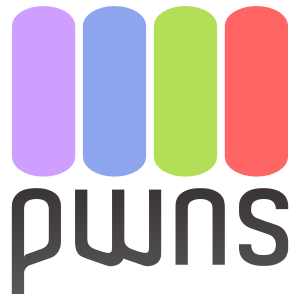

# Research and development

(This page is also available [in Croatian](../hr/istrazivanje-i-razvoj.md).)

In the area of software development, regardless of the topic and required background, we are interested in high priority and high impact TODOs in open source projects which may or may not have enough developers working on them. As for a particular topic, we are interested in computational biochemistry tools and extending principles of free and open source software to pharmacy and biotechnology.

## Radeon open source Linux driver development

### Background

> AMD should understand that the openness of OpenCL gives them an advantage and should push it much much much harder.

-- [Vedran Miletić, June 2014](https://youtu.be/UYnnbsU0BoQ?t=40m54s)

AMD took a stand for open source which has been wanted and recommended by many (including us), and we respect that. By choosing to base its Linux and high performance computing strategy on open source software, AMD has made a large step forward. We hope AMD will deliver on its promise and will be following their actions. Further reading:

- [Official website](https://gpuopen.com/)
- [AnandTech](https://www.anandtech.com/show/9853/amd-gpuopen-linux-open-source)
- [Ars Technica](https://arstechnica.com/information-technology/2015/12/amd-embraces-open-source-to-take-on-nvidias-gameworks/)
- [ExtremeTech](https://www.extremetech.com/gaming/219434-amd-finally-unveils-an-open-source-answer-to-nvidias-gameworks)
- [HotHardware](https://hothardware.com/news/amd-goes-open-source-announces-gpuopen-initiative-new-compiler-and-drivers-for-lunix-and-hpc)
- [ITWorld](https://www.itworld.com/article/3015782/linux/amd-announces-open-source-initiative-gpuopen.html)
- [PCWorld](https://www.pcworld.com/article/3014773/components-graphics/watch-out-gameworks-amds-gpuopen-will-offer-developers-deeper-access-to-its-chips.html)
- [Maximum PC](https://www.maximumpc.com/amd-rtg-summit-gpuopen-and-software/)
- [Phoronix](https://www.phoronix.com/scan.php?page=news_item&px=AMD-GPUOpen)
- [Softpedia](https://news.softpedia.com/news/amd-going-open-source-with-amdgpu-linux-driver-and-gpuopen-tools-497663.shtml)
- [Wccf tech](https://wccftech.com/amds-answer-to-nvidias-gameworks-gpuopen-announced-open-source-tools-graphics-effects-and-libraries/)

Finally, there is a somewhat personal take on the topic titled [AMD and the open source community are writing history](https://nudgedelastic.band/2016/01/amd-and-the-open-source-community-are-writing-history/).

### Improvements to r600/radeonsi OpenCL

In order to help adoption of [OpenCL](https://www.khronos.org/opencl/), ideally on open source GPU drivers, we want to improve [Mesa3D](https://www.mesa3d.org/) [r600](https://dri.freedesktop.org/wiki/R600ToDo/) and especially [radeonsi](https://dri.freedesktop.org/wiki/RadeonsiToDo/) Gallium drivers in terms of support for various OpenCL features (in particular: OpenCL 1.2 support, adding missing features from OpenCL 1.1 and 1.0, and fixing nonadherence to the standard).

The goal is to make AMD Radeon GPUs be able to run [GROMACS](http://www.gromacs.org/), [LAMMPS](https://lammps.sandia.gov/), and [CP2K](https://www.cp2k.org/). To do this, improvements will happen first in the [Radeon OpenCL driver](https://dri.freedesktop.org/wiki/GalliumCompute/), and subsequently in the OpenCL applications. Where the applications adhere to the standard, no changes will be done. Further information:

- [tstellar dev blog](http://www.stellard.net/tom/blog/)
- [Bug 99553 -- Tracker bug for runnning OpenCL applications on Clover](https://bugs.freedesktop.org/show_bug.cgi?id=99553)
- [XDC2013: Tom Stellard - Clover Status Update](https://www.youtube.com/watch?v=UTaRlmsCro4)
- [FSOSS 2014 Day 2 Tom Stellard AMD Open Source GPU Drivers](https://www.youtube.com/watch?v=JZ-EEgXYzUk)
- V. Miletić, S. Páll, F. Gräter, ["Towards fully open source GPU accelerated molecular dynamics simulation."](https://llvm.org/devmtg/2016-03/#lightning6) in *2016 European LLVM Developers' Meeting*, Barcelona, Spain, 2016.
- V. Miletić, S. Páll, F. Gräter, ["LLVM AMDGPU for High Performance Computing: are we competitive yet?"](https://llvm.org/devmtg/2017-03//2017/02/20/accepted-sessions.html#31) in *2017 European LLVM Developers' Meeting*, Saarbrücken, Germany, 2017.

## Photonic WDM Network Simulator (PWNS)

### Introduction

Photonic (formerly Prototype) WDM Network Simulator (PWNS) is an extension of the [ns-3 network simulator](https://www.nsnam.org/) that enables simulating optical transport networks. The project name is a parody on Optical WDM network simulator (OWns; since "own" in [leetspeak](https://www.urbandictionary.com/define.php?term=leet%20speak) becomes ["pwn"](https://en.wikipedia.org/wiki/Pwn), "owns" becomes "pwns"), a project with similar goals implemented in ns-2 and described in B. Wen, N. M. Bhide, R. K. Shenai, K. M. Sivalingam, and others, ["Optical wavelength division multiplexing (WDM) network simulator (OWns): architecture and performance studies,"](https://pdfs.semanticscholar.org/4bb0/395e580baa22ba96969c54f966248d37a43f.pdf) *SPIE Optical Networks Magazine*, vol. 2, no. 5, pp. 16--26, 2001.

### Features

PWNS contains models for the following optical transport network components:

- edge network devices,
- core network devices,
- physical interfaces,
- channels, and
- control plane.

In addition, PWNS provides models for the following physical and virtual entities:

- physical cable containing one or more fibers,
- shared risk link group containing parts of two or more cables that share a physical location,
- lightpath passing through one or more network devices,
- logical channel that has working and spare wavelength path,
- failure and repair models, and
- uptime and downtime trackers.

Current version of PWNS code is available on [its Bitbucket project](https://bitbucket.org/pwns/ns-3-dev-pwns); upstreaming of selected components to ns-3 might happen in the future. If you use our code in your work, please cite the related references among those listed below. Bug reports and code contributions are always welcome.

### References

1. V. Miletić, ["Method for Optimizing Availability of Optical Telecommunication Network in Presence of Correlated Failures,"](https://vedran.miletic.net/files/phd-thesis-vedran-miletic.pdf) PhD thesis, University of Zagreb, 2015.
1. V. Miletić, T. Šubić, and B. Mikac, ["Optimizing Maximum Shared Risk Link Group Disjoint Path Algorithm using NVIDIA CUDA Heterogeneous Parallel Programming Platform,"](https://vedran.miletic.net/files/MileticSubicMikac-OMSRLGDPANCHPPP.pdf) in *Telecommunications (BIHTEL), 2014 X International Symposium on*, 2014, pp. 1--6.
1. V. Miletić, D. Maniadakis, B. Mikac, and D. Varoutas, ["On the Influence of the Underlying Network Topology on Optical Telecommunication Network Availability Under Shared Risk Link Group Failures,"](https://vedran.miletic.net/files/MileticManiadakisMikacVaroutas-OIUNTOTNASRLGF.pdf) in *2014 10th International Conference on the Design of Reliable Communication Networks (DRCN)*, 2014, pp. 1--8.
1. V. Miletić, B. Mikac, and M. Džanko, ["Impact Evaluation of Physical Length of Shared Risk Link Groups on Optical Network Availability Using Monte Carlo Simulation,"](https://vedran.miletic.net/files/MileticMikacDzanko-IEPLSRLGONAUMCS.pdf) in *Networks and Optical Communications (NOC), 2013 18th European Conference on*, 2013, pp. 249--255.
1. V. Miletić, B. Mikac, and M. Džanko, ["Modelling Optical Network Components: A Network Simulator-Based Approach,"](https://vedran.miletic.net/files/MileticMikacDzanko-MONCNSBA.pdf) in *Telecommunications (BIHTEL), 2012 IX International Symposium on*, 2012, pp. 1--6.
