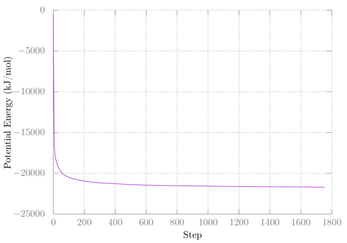
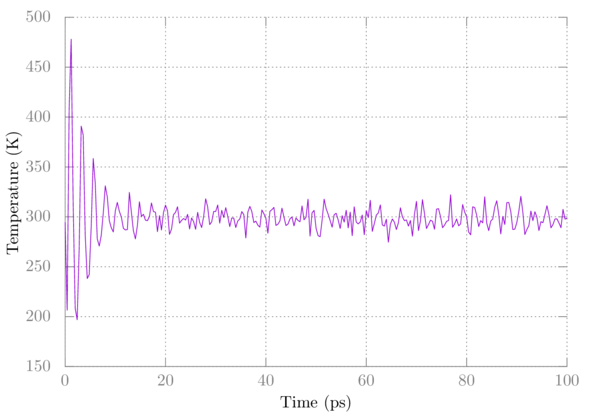
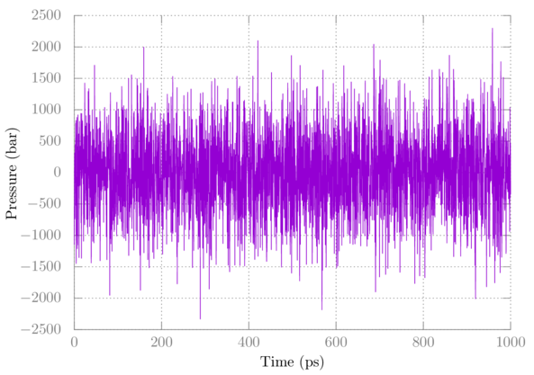
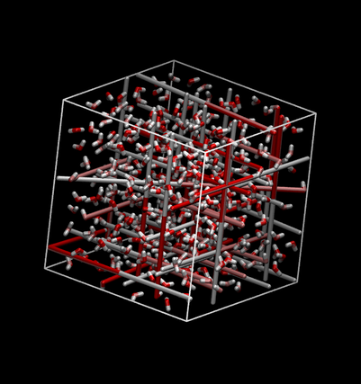
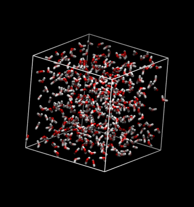

# GROMACS Tutorial 1 -- Water

In this introductory tutorial, I'll show you how to create a box of water and
run a simple simulation on it with constant temperature and pressure. In the end,
we'll find out the density of water.

## Setup

Every GROMACS simulations needs three essential files: structure (.gro/.pdb),
topology (.top), and parameters (.mdp). The structure file contains the
Cartesian coordinates of every atomic site in the system. The topology file
contains information on how each atomic site interacts with other atomic sites,
whether that is in non-bonded interactions or bonded interactions. This
information is provided by the force field. Non-bonded interactions included van
der Waals interactions and Coulomb interactions. Bonded interactions include
bonds, angles, and dihedrals. The parameters file includes information on how
long to run the simulation, the timestep, temperature and pressure coupling,
etc. Below we'll obtain/create these files.

At this point, I would suggest creating a directory to store files for this
tutorial.

### Topology file

We'll start with the topology file. Typically a topology file uses an `#include`
statement to include the force field to be used. This force field includes `[
atomtypes ]`, `[ bondtypes ]`, `[ angletypes ]`, and `[ dihedraltypes ]`
directives. Then in the topology file we usually specify different `[
moleculetype ]` directives which contain `[ atoms ]`, `[ bonds ]`, and `[
dihedrals ]` which refer back to the force field. Don't worry about this too
much right now. Water models include all of these for us. See Chapter 5 of the
reference manual for more information.

Create a file named `topol.top` with the following text:

```
#include "oplsaa.ff/forcefield.itp"
#include "oplsaa.ff/tip4pew.itp"

[ System ]
TIP4PEW

[ Molecules ]
```

As you can see we've included the force field for OPLS-AA. Additionally, we've
included the TIP4PEW water model. After this, you'll see a `[ System ]` directive,
which includes just the name of the system, which can be anything you want.
Lastly, we list out each `moleculetype` and how many there are under `[
Molecules ]`. Right now we don't have any (we'll get those in a minute).

### Structure file

The structure of TIP4PEW is already provided by GROMACS in the topology
directory. This standard location is typically `/usr/share/gromacs/top`, but you
may have it installed in a different directory. If you are properly sourcing
GMXRC then it will be located at `$GMXDATA/top`. In that directory, you'll see
several `.gro` files, one of which is `tip4p.gro`. You'll also see the folder
`oplsaa.ff` which we've included in our topology file above. There isn't a
structure file specific to TIP4PEW. The four-point water structure is essentially
the same for TIP4P and TIP4PEW. What makes them different is the force field
parameters.

To create a box of water using that structure file do:

``` shell
$ gmx solvate -cs tip4p -o conf.gro -box 2.3 2.3 2.3 -p topol.top
```

If you open back up `topol.top` you'll see that a line has been added at the
end with the word `SOL` and number. `SOL` is the name of the `moleculetype` that
is defined in `oplsaa.ff/tip4pew.itp`. When we ran _gmx solvate_, GROMACS added
enough water molecules to fill a box 2.3 nm in each direction.

### Parameter files

Now we need a set of parameter files so that GROMACS knows what to do with our
starting structure. Simulations almost always have three main parts:
minimization, equilibration, and production. Minimization and equilibration can
be broken down into multiple steps. Each of these needs its own parameters
file. In this case, we'll be doing two minimizations, two equilibrations, and one
production run.

The files we'll be using should be downloaded [from here](mdp.tar.gz).

There will be a few things common to all five of our files. In each description,
I only give a very small comment. See the [GROMACS page on
this](https://manual.gromacs.org/documentation/5.1/user-guide/mdp-options.html)
for more information on each option.

| parameter | value | explanation |
| --------- | ----- | ----------- |
| cutoff-scheme | Verlet | Use in creating neighbor lists. This is now the default, but we provide it here in order to avoid any notes.|
| coulombtype | PME | Use Particle-Mesh Ewald for long-range (k-space) electrostatics. |
| rcoulomb | 1.0 | Cut-off for real/k-space for PME (nm). |
| vdwtype | Cut-off | van der Walls forces cut-off at `rvdw`. |
| rvdw | 1.0 | Cut-off for VDW (nm). |
| DispCorr | EnerPress | Long-range correction for VDW for both energy and pressure. |

Cut-off distances should be set keeping in mind how the force field was
parameterized. In other words, it's a good idea to look at the journal article
that describes how the force field was created. We've chosen 1.0 nm for our
cut-offs here, which is common enough for OPLS, but you may determine for your
system to choose something else.

Additionally in each part, we'll also be outputting an energy file, a log file,
and a compressed trajectory file. The rate of output (in simulation steps) for
these is set using `nstenergy`, `nstlog`, and `nstxout-compressed`,
respectively. We'll output more information in the production run.

For each part, except for the second minimization, we'll also be constraining
all bonds involving hydrogen using the LINCS algorithm by setting
`constraint-algorithm = lincs` and `constraints = h-bonds`. This allows us to use
a larger time step than otherwise.

For the first minimization, we use the steepest descents algorithm by setting
`integrator = steep` to minimize the energy of the system with a maximum of
1,000 steps (`nsteps = 1000`). The minimization will stop if the energy
converges before then. Additionally, we have `define =
-DFLEXIBLE`. This lets GROMACS know to use flexible water since by default all
water models are rigid using an algorithm called SETTLE. In the water model's
topology file, which we have included, there is an if statement that looks for
the `FLEXIBLE` variable to be defined. The purpose of this first minimization is to
get the molecules in a good starting position so we can turn on SETTLE without
any errors.

In the second minimization we are simply removing `define = -DFLEXIBLE` and
increasing the number of maximum steps to 50,000.

The last three parts -- the two equilibrations and production -- all use the
leap-frog integrator by setting `integrator = md`. Additionally, each one will
use a 2 fs time step by setting `dt = 0.002`.

For the first equilibration step, there are a few things to note. We are adding
several parameters that are shown below:

| parameter | value | explanation |
| --------- | ----- | ----------- |
| gen-vel | yes | Generate velocities for each atomic site according to a Maxwell-Boltzmann distribution. **Only generate velocities for your first equilibration step**. This gets us close to the temperature at which we will couple the system. |
| gen-temp | 298.15 | Temperature in K to use for `gen-vel`. Unless you are doing some strange/interesting stuff, this should be the same as `ref-t`. |
| tcoupl | Nose-Hoover | The algorithm to use for temperature coupling. Nose-Hoover correctly produces the canonical ensemble. |
| tc-grps | System | Which groups should be temperature-coupled. You can couple different groups of atoms separately, but we'll just couple the whole system. |
| tau-t | 2.0 | Time constant for coupling. See the manual for details. |
| ref-t | 298.15 | The temperature in K at which to couple. |
| nhchainlength | 1 | Leap-frog integrator only supports 1, but by default, this is 10. This is set so GROMACS doesn't complain to us. |

The point of this first equilibration is to get us to the correct temperature
(298.15 K) before adding pressure coupling. Adding temperature and pressure
coupling at the same time can cause your system to be unstable and crash. We
don't want to shock our system at the beginning. Additionally, we have set
`nsteps = 50000`, so with a 2 fs time step, that means that this will run for 100
ps. This is adequate for what we are doing here, but in larger / more
complicated systems you may need to equilibrate longer.

The second equilibration adds pressure coupling. Note that we are _not_
generating velocities again, since that will undo some of the work we just did.
We also set `continuation = yes` for the constraints, since we are continuing
the simulation from the first equilibration. This part will run for 1 ns. Again,
this may need to be longer for other systems.

| parameter | value | explanation |
| --------- | ----- | ----------- |
| pcoupl | Parrinello-Rahman | The algorithm to use for pressure coupling. Parrinello-Rahman correctly produces the isobaric-isothermal ensemble when used with Nose-Hoover. |
| tau-p | 2.0 | Time constant for pressure coupling. See the manual for details. |
| ref-p | 1.0 | The pressure in bars at which to pressure couple. |
| compressibility | 4.46e-5 | The compressibility of the system in bar^-1. |

For the production run, everything is exactly the same as the last
equilibration, except we are outputting more data and running for 10 ns.

## Simulation

We have all the files we need now to run each part of the simulation. In each
part you typically run *gmx grompp* to preprocess the three files we now have
(.gro, .top, and .mdp) into a .tpr file (sometimes confusingly also called a
topology file).

### Minmizations

First, let's run our two minimization steps by doing the following:

``` shell
$ gmx grompp -f mdp/min.mdp -o min -pp min -po min
$ gmx mdrun -deffnm min

$ gmx grompp -f mdp/min2.mdp -o min2 -pp min2 -po min2 -c min -t min
$ gmx mdrun -deffnm min2
```

At each part, we are reading in the .mdp file with the `-f` flag. By default if
`-c` and `-p` flags are not specified GROMACS uses `conf.gro` and `topol.top`
for the structure and topology files. Additionally we are outputting a processed
topology file `-pp` and mdp file `-po`. These are optional, but probably worth
looking at, especially the processed mdp file, since it is commented.

At each subsequent step we read in the previous step's last structure file or
checkpoint file using the `-c` and `-t` flags. By default GROMACS outputs
checkpoint files every 15 minutes and at the last step. If the checkpoint file
is not present, GROMACS will use the structure file defined by `-c`, so it is a
good practice to specify both. At each *gmx mdrun* we are telling GROMACS to use
a default name for each input and output file, since several files are output.

Note we are using `-maxwarn 1` for the second minimization. Only use this flag
if you know what you are doing! In this case we get a warning about the
efficiency of L-BFGS which we can safely bypass.

To get a feel for what's going on, let's extract the potential energy of both of
these parts using the GROMACS command *gmx energy*. Do the following and enter
the number that corresponds with `Potential`, followed by enter again:

``` shell
$ gmx energy -f min.edr -o min-energy.xvg
```

Now do the same for the second minimization:

``` shell
$ gmx energy -f min2.edr -o min2-energy.xvg
```

The header of the resulting `.xvg.` file will contain information for use with
the Grace plotting program. I use gnuplot so some of these lines will cause
errors. I just simply replace every `@` character with `#` in the `.xvg.` file
and then I can use gnuplot. To plot with first start gnuplot:

``` shell
$ gnuplot
```

Then in the gnuplot terminal do:

``` gnuplot
> plot 'min-energy.xvg' w l
```

To plot the second minimization step do:

``` gnuplot
> plot 'min2-energy.xvg' w l
```

Your first plot should look something like this:



My second minimization didn't change anything, so I have nothing to plot.

### Equilibration 1 (NVT)

Now that we have a good starting structure, let's do the first equilibration
step, by adding the temperature coupling:

``` shell
$ gmx grompp -f mdp/eql.mdp -o eql -pp eql -po eql -c min2 -t min2
$ gmx mdrun -deffnm eql
```

Let's take a look at how the temperature varies throughout the simulation:

``` shell
$ gmx energy -f eql.edr -o eql-temp.xvg 
```

Choose the number corresponding to `Temperature` at the prompt and hit enter
again. Plot it in gnuplot as above. You should see something like:



Note that the temperature initially fluctuates wildly but eventually
settles.

### Equilibration 2 (NPT)

For our last equilibration, as stated earlier, we're adding a pressure coupling:

``` shell
$ gmx grompp -f mdp/eql2.mdp -o eql2 -pp eql2 -po eql2 -c eql -t eql
$ gmx mdrun -deffnm eql2
```

You can check out the temperature and pressure using *gmx energy* as above.
Here's a plot of the pressure:



Note that pressure fluctuates quite a bit, which is normal. The average after
full equilibration should be close to 1 bar in this case.

### Production

Now for the production part do:

``` shell
$ gmx grompp -f mdp/prd.mdp -o prd -pp prd -po prd -c eql2 -t eql2
$ gmx mdrun -deffnm prd
```

## Analysis

Using *gmx energy* as above on `prd.edr`, get the average temperature, pressure,
and density. Are they what you expect?

Here's my output:

```
Energy                      Average   Err.Est.       RMSD  Tot-Drift
-------------------------------------------------------------------------------
Temperature                 298.145      0.019    8.65629  0.0338992  (K)
Pressure                    3.25876       0.97    688.616   -2.75083  (bar)
Density                     995.381       0.15      12.92  0.0705576  (kg/m^3)
```

If you look at the [TIP4PEW
paper](https://aip.scitation.org/doi/10.1063/1.1683075) in figure 4, you can see
we have achieved the correct density. Additionally, note that [Wolfram Alpha
says](https://www.wolframalpha.com/input/?i=density+of+water+298.15+K)
the density of water at standard conditions is 997 kg/m^3.

You can also visualize your simulation using a program like
[vmd](https://www.ks.uiuc.edu/Research/vmd/). To open the production part with
vmd do:

``` shell
$ vmd prd.gro prd.xtc
```

Here's a snapshot:



Note that due to the periodic boundary condition this can look kind of strange
with bonds stretching across the box. You can make molecules whole by using *gmx
trjconv*:

``` shell
$ gmx trjconv -f prd.xtc -s prd.tpr -pbc mol -o prd-mol.xtc
```

Viewing that file should look much nicer:



## Summary

In this tutorial, we generate a box of TIP4PEW water using *gmx solvate*. We
simulated it in five distinct parts: minimization 1, minimization 2,
equilbiration 1, equilibration 2, and production. Each part used its own .mdp
files which were explained. At each part, we used *gmx energy* to extract useful
information about the simulation. After the production run, we were able to find
the density of TIP4PEW water.
