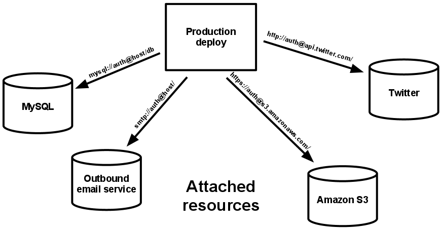

!!! note
    Sadržaj u nastavku je prijevod stranice [IV. Backing services](https://12factor.net/backing-services) na web sjedištu [The Twelve-Factor App](https://12factor.net/).

## IV. Prateće usluge

### Tretirajte prateće usluge kao priložene resurse

*Prateća usluga* je svaka usluga koju aplikacija koristi putem mreže kao dio svog normalnog rada. Primjeri uključuju spremišta podataka (kao što je [MariaDB](https://mariadb.org/) ili [CouchDB](https://couchdb.apache.org/)), sustave za slanje poruka/redanje (kao što je [RabbitMQ](https://www.rabbitmq.com/) ili [Beanstalkd](https://beanstalkd.github.io)), SMTP usluge za odlaznu e-poštu (kao što je [Postfix](http://www.postfix.org/)) i sustavi za predmemoriju (kao što je [Memcached](https://memcached.org/)).

Pratećim uslugama poput baze podataka tradicionalno upravljaju isti administratori sustava koji implementiraju aplikaciju u izvršnom okruženju. Osim ovih usluga kojima se upravlja lokalno, aplikacija također može imati usluge koje pružaju i kojima upravljaju treće strane. Primjeri uključuju SMTP usluge (kao što je [Postmark](https://postmarkapp.com/)), usluge prikupljanja metrike (kao što je [New Relic](https://newrelic.com/) ili [Loggly](https://www.loggly.com/)), usluge pohrane binarne imovine (kao što je [Amazon S3](https://aws.amazon.com/s3/)), pa čak i korisničke usluge dostupne putem API-ja (kao što je [Twitter](https://developer.twitter.com/), [Google karte](https://developers.google.com/maps/) ili [Last.fm](https://www.last.fm/api)).

**Kôd za dvanestofaktorsku aplikaciju ne pravi razliku između lokalnih usluga i usluga treće strane.** Aplikaciji su obje vrste priloženi resursi, kojima se pristupa putem URL-a ili drugog lokatora/vjerodajnica pohranjenih u [konfiguraciji](config.md). [Implementacija](codebase.md) dvanaestofaktorske aplikacije trebala bi moći zamijeniti lokalnu MariaDB bazu podataka onom kojom upravlja treća strana (kao što je [Amazon RDS](https://aws.amazon.com/rds/)) bez ikakvih promjena kôda aplikacije. Isto tako, lokalni SMTP poslužitelj mogao bi se zamijeniti SMTP uslugom treće strane (kao što je Postmark) bez promjene kôda. U oba slučaja potrebno je promijeniti samo dršku resursa u konfiguraciji.

Svaka posebna prateća usluga je *resurs*. Na primjer, MariaDB baza podataka je resurs; dvije MariaDB baze podataka (koriste se za usitnjavanje na aplikacijskom sloju) karakteriziraju se kao dva različita resursa. Dvanaestofaktorska aplikacija tretira te baze podataka kao *priložene resurse*, što ukazuje na njihovu labavu povezanost s implementacijom na koju su pripojene.

Resursi se mogu po volji priključiti i odvojiti od implementacija. Na primjer, ako se baza podataka aplikacije loše ponaša zbog hardverskog problema, administrator aplikacije može pokrenuti novi poslužitelj baze podataka vraćen iz nedavne sigurnosne kopije. Trenutna produkcijska baza podataka mogla bi se odvojiti, a nova priključiti -- sve bez ikakvih promjena kôda.
