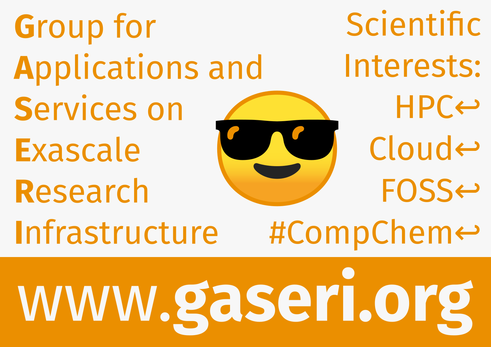

# O grupi

(Ova je stranica također dostupna [na engleskom jeziku](../en/index.md).)

**Grupa za aplikacije i usluge na eksaskalarnoj istraživačkoj infrastrukturi** (engl. *Group for Applications and Services on Exascale Research Infrastructure*, kraće GASERI) je istraživačka, razvojna i nastavna jedinica na [Fakultet informatike i digitalnih tehnologija](https://www.inf.uniri.hr/) [Sveučilišta u Rijeci](https://uniri.hr/).

## Uvodna prezentacija

[Svijetla pozadina](https://cdn.group.miletic.net/GASERI-Introductory-presentation-light-background.pdf){ .md-button } [Tamna pozadina](https://cdn.group.miletic.net/GASERI-Introductory-presentation-dark-background.pdf){ .md-button .md-button--primary }

## Interesi

Superračunalo, također poznato kao računalo visokih performansi (engl. *high performance computer*, kraće HPC), nudi mnogo veće performanse od osobnog računala. Performanse se obično mjere brojem operacija s pomičnim zarezom u sekundi (engl. *floating-point operations per second*, kraće FLOPS) koje računalo može izvesti; osobno računalo može izvesti do desetke teraFLOPS-a, dok moderni HPC-i mogu izvesti stotine petaFLOPS-a, što rezultira faktorom ubrzanja od otprilike deset tisuća.

Takva su ubrzanja omogućena korištenjem modela paralelnog i distribuiranog programiranja. S performansama superračunala koje se približavaju exaFLOPS-u, arhitektura računala postaje sve heterogenija, dok su modeli programiranja sve složeniji. Konačno, HPC se sve više nudi kao usluga u oblaku, što predstavlja vlastiti skup izazova. Mnoga znanstvena područja ovise o korištenju superračunala za svoje izračune; posebno se računalna biokemija oslanja na superračunala za proučavanje i predviđanje strukture proteina, kao i njihove dinamike, funkcije i reaktivnosti s malim molekulama (ligandima).

Glavni interes Grupe za aplikacije i usluge na eksaskalarnoj istraživačkoj infrastrukturi je primjena eksaskalarnog računarstva za rješavanje problema u računalnoj biokemiji. Cilj je dizajnirati algoritme boljih performansi i ponuditi njihove implementacije za akademsku i industrijsku upotrebu. Računalni kemičari koji imaju pristup boljim alatima mogu proučavati postojeće sustave brže, detaljnije ili umjesto njih proučavati veće sustave.

Specifični fokusi u sadašnjosti su distribuirane arhitekture baza podataka kemijskih spojeva koje zadovoljavaju zahtjeve skalabilnosti i pouzdanosti visoko propusnih virtualnih pregleda, napredak algoritama molekulske dinamike koji im omogućuje učinkovito korištenje eksaskalarnih superračunalnih resursa te uspostavljanje hrvatskog centra kompetencija za HPC.

## Metode

Grupa koristi i dalje razvija metode za predviđanje pristajanja liganda na protein, simulaciju molekularne dinamike, Monte Carlo metodu i druge računalne tehnike za proučavanje statičkih i dinamičkih svojstava biomolekulskih sustava. Interdisciplinarni pristup u grupi objedinjuje stručnost fizičara, matematičara, informatičara i računalnih znanstvenika. Temeljna motivacija je raditi bolju znanost na način otvorenog izbora; znanost je u suštini otvorena i takva bi trebala i ostati. Način otvorenog izvora uključuje otvorene formate datoteka, slobodni softver i softver otvorenog koda, otvoreni hardver, obrambeno licenciranje patenata i otvoreni pristup objavljenim radovima.

## Kako se uključiti

Naš znanstveno-istraživački program zasniva se uvelike na razvoju softvera, fokusirajući se uglavnom na primjenu metoda heterogenog, paralelnog i distribuiranog programiranja u području računalne biokemije. Ako želite biti dio naše grupe, dobrodošli ste, ali molimo vas da pored intenzivnog rada na kolegijima u području kojim se grupa bavi razmislite o sljedećim točkama:

- Potrebno je imati vještinu programiranja u [C/C++-u](https://cppreference.com/) i [Pythonu](https://www.python.org/) te želju za radom sa softverom kao sastavnim dijelom znanstvenog istraživanja. To uključuje iskustvo s objektno orijentiranim dizajnom softvera, pisanjem testova, korištenjem i pisanjem API dokumentacije, primjenom sustava za upravljanje verzijama, debuggerima i profilerima.
- Iskustvo s pojedinim razvojnim okruženjima, sustavima za praćenje grešaka, sustavima za kontinuiranu integraciju i ostalim pomoćnim alatima kao i poznavanje drugih programskih jezika (npr. [JavaScript](https://javascript.info/)/[TypeScript](https://www.typescriptlang.org/) i [PHP](https://www.php.net/)) je korisno.
- Razvoj paralelnih programa korištenjem tehnologija kao što su [pthreads](https://en.wikipedia.org/wiki/POSIX_Threads), OpenMP, [Threading Building Blocks](https://software.intel.com/content/www/us/en/develop/tools/oneapi/components/onetbb.html), [Taskflow](https://taskflow.github.io/), MPI, CUDA, [OpenCL](https://www.khronos.org/opencl/) i [SYCL](https://www.khronos.org/sycl/) na Linuxu/Unixu je vrlo korisno za rad u području, ali nije preduvjet.
- Iskustvo sa sustavima za upravljanje oblacima kao što su [OpenStack](https://www.openstack.org/) i [HashiCorp](https://www.hashicorp.com/) (primarno [Terraform](https://www.terraform.io/), [Packer](https://www.packer.io/) i [Vagrant](https://www.vagrantup.com/)) alati je korisno.
- Potrebno je imati iskustvo u radu u sučelju naredbenog retka na [Linuxu](https://www.linux.com/), [FreeBSD-u](https://www.freebsd.org/), [macOS-u](https://www.apple.com/macos/) ili bilo kojem drugom operacijskom sustavu [sličnom Unixu](https://www.pcmag.com/encyclopedia/term/unix-like) (iako međusobno nisu isti, dovojno su slični da se većina znanja s jednog može primijeniti na preostalima). Ako imate iskustva samo u radu s Windowsima, iako je ono općenito vrlo korisno, u ovom slučaju vam nažalost neće biti od velike pomoći.

Ako posjedujete ove vještine i entuzijazam za znanstveno-istraživačkim radom te se želite pridružiti našem istraživačkim i razvojnim aktivnostima, molimo da [voditelju grupe](ljudi.md) pošaljete e-mail koji uključuje:

- Kratki opis (50 do 100 riječi) vašeg istraživačkog interesa unutar [nekog od aktualnih projekata na kojima grupa radi](istrazivanje-i-razvoj.md).
- Primjer softvera u bilo kojem programskom jeziku za Linux/Unix koji ste napisali; može biti i projekt s nekog kolegija. Pritom je slanje izvornog koda softvera u obliku tar arhive sasvim u redu (nemojte koristiti [vlasnički format RAR](https://en.wikipedia.org/wiki/RAR_(file_format)), njegovo korištenje ne implicira da ćete [voziti](https://youtu.be/_uOoV0mtX3E) [Rari](https://youtu.be/vL2Ja5uMhnk)), ali poveznica na repozitorij s kodom na [GitLabu](https://about.gitlab.com/) ili [GitHubu](https://github.com/) je preferirana. Priložite opis što vaš softver radi i kako, ili, još bolje, poveznicu na njegovu dokumentaciju. Ukoliko vaš kod koristi neku od metoda heterogenog, paralelnog ili distribuiranog programiranja, to je vrlo korisno, ali nije preduvjet.

## Povijest

Grupa je započela s radom u listopadu 2021. Izgrađena je na nasljeđu Laboratorija za računalne mreže, paralelizaciju i simulaciju (engl. *Computer Networks, Parallelization, and Simulation Laboratory*, kraće CNPSLab) koji je do listopada 2021. bio dio [Odjela za informatiku](https://www.inf.uniri.hr/).

Na zasebnoj stranici možete pročitati [više o povijesti grupe](povijest.md).

## Kontakt

### E-pošta

Adrese e-pošte [članova osoblja](ljudi.md#osoblje) imaju sljedeći oblik: *ime.prezime@inf.uniri.hr*

### Društvene mreže

- [GASERI na GitHubu](https://github.com/gaseri)
- [GASERI na LinkedInu](https://www.linkedin.com/company/gaseri)

### Položaj

Grupa za aplikacije i usluge na eksaskalarnoj istraživačkoj infrastrukturi  
Fakultet informatike i digitalnih tehnologija Sveučilišta u Rijeci  
Radmile Matejčić 2  
51000 Rijeka  
Hrvatska

<iframe src="https://www.openstreetmap.org/export/embed.html?bbox=14.465005695819857%2C45.32756626493193%2C14.46918457746506%2C45.32927471428796&amp;layer=mapnik&amp;marker=45.32842049605121%2C14.467095136642456" style="border: 1px solid black; width: 100%; height: 25em"></iframe>

## Poster

[Preuzimanje u formatu PDF (A3, položeno)](../images/gaseri-poster.pdf)
