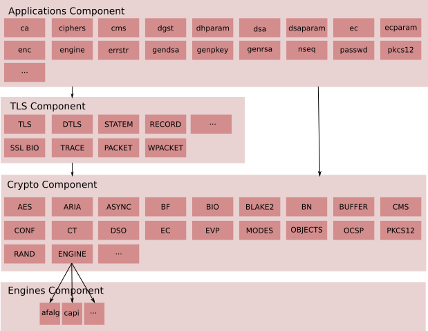
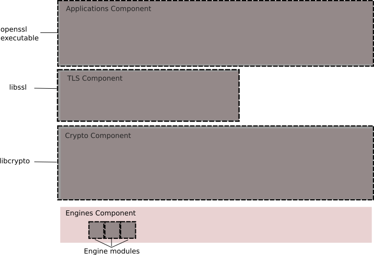

# Korištenje osnovnih kriptografskih algoritama

## Skup alata OpenSSL

[OpenSSL](https://www.openssl.org/) je skup alata za baratanje protokolima [Transport Layer Security (TLS) i Secure Sockets Layer (SSL)](https://httpd.apache.org/docs/current/ssl/ssl_intro.html). Koristi se za kodiranje i dekodiranje teksta, šifriranje datoteka, hashiranje, kriptografiju s javnim ključem, digitalno potpisivanje, stvaranje i povlačenje certifikata, testiranje TLS/SSL veza te brojne druge kriptografske funkcije. Slobodni je softver otvorenog koda [inicijalno izdan pod vlastitom licencom sličnom Apachevoj, a verzije od 3.0.0 nadalje izdane su upravo pod licencom Apache 2.0](https://www.openssl.org/source/license.html). Podržava velik broj operacijskih sustava: [primarna platforma koju autori koriste je Linux](https://www.openssl.org/policies/platformpolicy.html), ali podržani su i drugi operacijski sustavi slični Unixu (uključujući FreeBSD, OpenBSD, NetBSD, DragonFly BSD, macOS, Solaris i QNX) te OpenVMS i Microsoft Windows. Krajem 2018. godine OpenSSL je proslavio [dvadeset godina postojanja](https://www.openssl.org/blog/blog/2018/12/20/20years/).

OpenSSL ima četiri komponente koje implementiraju pojedine značajke: aplikacije, TLS, kriptografija i pogoni; svaka od njih je dodatno podijeljena u module. OpenSSL se može koristiti i kao [aplikacija naredbenog retka](https://www.openssl.org/docs/man1.1.1/man1/) i kao [biblioteka, putem aplikacijskog programskog sučelja](https://www.openssl.org/docs/man1.1.1/man3/). Pored toga, moguće je i programirati [vlastite](https://www.openssl.org/blog/blog/2015/10/08/engine-building-lesson-1-a-minimum-useless-engine/) [pogone](https://www.openssl.org/blog/blog/2015/11/23/engine-building-lesson-2-an-example-md5-engine/) koji služe za korištenje akceleratora kriptografskih algoritama, bili ti akceleratori specifični za kriptografiju ili općeniti grafički procesori koji između ostalog mogu izvoditi i kriptografiju.



**Slika:** Konceptualne komponente OpenSSL-a. (Slika preuzeta iz [OpenSSL Strategic Architecture](https://www.openssl.org/docs/OpenSSLStrategicArchitecture.html).)

### Kriptografski algoritmi

OpenSSL ima podršku za mnogo kriptografskih algoritama, koje možemo podijeliti u tri skupine:

- Algoritmi za hashiranje:

    - [BLAKE2](https://en.wikipedia.org/wiki/BLAKE_(hash_function)#BLAKE2),
    - [GOST R 34.11-94](https://en.wikipedia.org/wiki/GOST_(hash_function)),
    - [MD2](https://en.wikipedia.org/wiki/MD2_(cryptography)),
    - [MD4](https://en.wikipedia.org/wiki/MD4),
    - [MD5](https://en.wikipedia.org/wiki/MD5),
    - [MDC-2](https://en.wikipedia.org/wiki/MDC-2),
    - [RIPEMD-160](https://en.wikipedia.org/wiki/RIPEMD-160),
    - [SHA-1](https://en.wikipedia.org/wiki/SHA-1),
    - [SHA-2](https://en.wikipedia.org/wiki/SHA-2),
    - [SHA-3](https://en.wikipedia.org/wiki/SHA-2),
    - [SM3](https://en.wikipedia.org/wiki/SM3_(hash_function))
    - [Whirlpool](https://en.wikipedia.org/wiki/Whirlpool_(hash_function)).

- Algoritmi za šifriranje:

    - [AES](https://en.wikipedia.org/wiki/Advanced_Encryption_Standard),
    - [ARIA](https://en.wikipedia.org/wiki/ARIA_(cipher)),
    - [Blowfish](https://en.wikipedia.org/wiki/Blowfish_(cipher)),
    - [Camellia](https://en.wikipedia.org/wiki/Camellia_(cipher)),
    - [ChaCha20](https://en.wikipedia.org/wiki/Salsa20#ChaCha_variant),
    - [CAST-128](https://en.wikipedia.org/wiki/CAST-128),
    - [DES](https://en.wikipedia.org/wiki/Data_Encryption_Standard),
    - [GOST 28147-89](https://en.wikipedia.org/wiki/GOST_(block_cipher)),
    - [IDEA](https://en.wikipedia.org/wiki/International_Data_Encryption_Algorithm),
    - [Poly1305](https://en.wikipedia.org/wiki/Poly1305),
    - [RC2](https://en.wikipedia.org/wiki/RC2),
    - [RC4](https://en.wikipedia.org/wiki/RC4),
    - [RC5](https://en.wikipedia.org/wiki/RC5),
    - [SEED](https://en.wikipedia.org/wiki/SEED),
    - [SM4](https://en.wikipedia.org/wiki/SM4_(cipher))
    - [Trostruki DES](https://en.wikipedia.org/wiki/Triple_DES).

- Algoritmi za šifriranje javnim ključem:

    - [RSA](https://en.wikipedia.org/wiki/RSA_(algorithm)),
    - [DSA](https://en.wikipedia.org/wiki/Digital_Signature_Algorithm),
    - [Diffie--Hellmanova razmjena ključeva](https://en.wikipedia.org/wiki/Diffie--Hellman_key_exchange),
    - [Eliptična krivulja](https://en.wikipedia.org/wiki/Elliptic_curve_cryptography),
    - [GOST R 34.10-2001](https://en.wikipedia.org/wiki/GOST_(hash_function)),
    - [SM2](https://tools.ietf.org/html/draft-shen-sm2-ecdsa-02),
    - [Ed25519](https://en.wikipedia.org/wiki/EdDSA#Ed25519),
    - [X25519](https://en.wikipedia.org/wiki/Curve25519),
    - [Ed448](https://en.wikipedia.org/wiki/Curve448),
    - [X448](https://en.wikipedia.org/wiki/Curve448).

Na službenim stranicama može se naći [popis RFC-a koji je relevantan za implementacije tih algoritama u OpenSSL-u](https://www.openssl.org/docs/standards.html).

### Biblioteke

OpenSSL je na većini distribucija Linuxa i drugih operacijskih sustava sličnih Unixu pakiran u tri dijela: biblioteka s kriptografskim algoritmima (`libcrypto`), biblioteka s implementacijom protokola TLS/SSL (`libssl`) i aplikacija naredbenog retka (`openssl`). Biblioteke `libcrypto` i `libssl` vrlo se često nalaze među osnovnim paketima distribucija Linuxa obzirom da ih brojne aplikacije koriste. Ilustracije radi, evo nekoliko primjera aplikacija koje koriste OpenSSL:

- sustav za udaljenu prijavu na računalo [OpenSSH](https://www.openssh.com/) koristi `libcrypto`,
- web preglednik [Mozilla Firefox](https://www.mozilla.org/firefox/) i web poslužitelj [Apache HTTP Server](https://httpd.apache.org/) koriste `libssl` i `libcrypto`,
- sustav za virtualnu privatnu mrežu [OpenVPN](https://openvpn.net/) koristi `openssl` (putem [easy-rsa](https://openvpn.net/community-resources/rsa-key-management/)), `libssl` i `libcrypto`.



**Slika:** Pakiranje OpenSSL-a. (Slika preuzeta iz [OpenSSL Strategic Architecture](https://www.openssl.org/docs/OpenSSLStrategicArchitecture.html).)

### Aplikacija naredbenog retka

Aplikaciju naredbenog retka pokrećemo upisivanjem naredbe `openssl` uz odgovarajuće parametre i argumente. Kako bi provjerili koja je verzija OpenSSL-a instaliranja na sustavu, koristimo opciju `version`:

``` shell
$ openssl version
OpenSSL 1.1.1a FIPS  20 Nov 2018
```

!!! warning
    Za verziju koju imamo svakako treba provjeriti [popis poznatih ranjivosti](https://www.openssl.org/news/vulnerabilities.html). Poznate ranjivosti uglavnom postoje u [svim verzijama](https://www.openssl.org/source/old/) osim [zadnjih izdanih](https://www.openssl.org/source/).

    Kada smo svjesni da imamo verziju OpenSSL-a za koju znamo da je ranjiva i na koji način, na nama je da odlučimo hoćemo li je nastaviti koristiti ili ne; može se dogoditi, primjerice, da nam ta ranjivost ne predstavlja problem jer se ona nalazi u implementaciji algoritma koji ne koristimo ili može biti slučaj da se kriptografijom na računalu bavimo isključivo u edukativne svrhe.

!!! note
    Specijalno, ako koristimo OpenSSL pakiran od strane neke distribucije Linuxa ili drugog operacijskog sustava sličnom Unixu, moguće je da verzija koju imamo uključuje zakrpe poznatih ranjivosti dodane od strane distributera. Štoviše, može se dogoditi da broj verzije sugerira da ranjivosti i dalje postoje, a da to nije slučaj te je potrebno detalje o zakrpanim ranjivostima dodatno provjeriti kod distributer. Primjerice, za Debian se [takve informacije za OpenSSL](https://security-tracker.debian.org/tracker/source-package/openssl) mogu naći u [Security Bug Trackeru](https://security-tracker.debian.org/).

OpenSSL ima mnogo različitih naredbi. Listu postojećih naredbi možemo vidjeti opcijom `help`, čiji ispis započinje standardnim naredbama:

``` shell
$ openssl help
Standard commands
asn1parse         ca                ciphers           cms
crl               crl2pkcs7         dgst              dhparam
enc               engine            errstr            gendsa
...
```

Slijedi lista naredbi za hashiranje:

```
Message Digest commands (see the [dgst' command for more details))
blake2b512        blake2s256        gost              md2
md4               md5               rmd160            sha1
sha256            sha3-224          sha3-256          sha3-384
...
```

Naposlijetku je lista naredbi za šifriranje:

```
Cipher commands (see the [enc' command for more details))
aes-128-cbc       aes-128-ecb       aes-192-cbc       aes-192-ecb
aes-256-cbc       aes-256-ecb       aria-128-cbc      aria-128-cfb
aria-128-cfb1     aria-128-cfb8     aria-128-ctr      aria-128-ecb
...
```

Neke od naredbi već u imenima sugeriraju implementaciju ranije navedenih kriptografskih algoritama koje OpenSSL podržava.

## Hashiranje i kriptografski sažetak

Hashiranje je proces preslikavanja skupa podataka proizvoljne veličine na skup podataka zadane veličine. Rezultat hashiranja nazivamo hash vrijednostima, hash kodovima, sažecima ili, jednostavno, hashevima.

### Hashiranje datoteke

Hashiranje datoteke izvršava se pomoću opcije `dgst`, uz navođenje željenog algoritma. Primjerice, pogledajmo hashiranje tekstualne datoteke `datoteka.txt` koja sadrži izraz `Hashiraj me!` algoritmom MD5.

``` shell
$ openssl dgst -md5 datoteka.txt
MD5(datoteka.txt)= bc838dd8ab805767036cbf99d5abd2b4
```

Za usporedbu, pogledajmo i hashiranje iste datoteke algoritmom SHA-1.

``` shell
$ openssl dgst -sha1 datoteka.txt
SHA1(datoteka.txt)= d18fe411b275397fba802b307460d108483f626d
```

Također, moguće je hashirati sadržaj izravno sa standardnog ulaza. Primjerice, za hashiranje algoritmom SM3 naredba bi bila oblika:

``` shell
$ echo "Hashiraj me!" | openssl dgst -sm3
(stdin)= f89e882b9c22d590f0f0a813f7352cfd857370151f96ad8cc45869274d8b981c
```

Više o dostupnim parametrima hashiranja možemo saznati naredbom `openssl help dgst` i na `man` stranici `dgst(1ssl)` (da, OpenSSL ima svoj odjeljak među stranicama `man`-a).

## Kodiranje i dekodiranje

Osim šifriranja i dešifriranja, kao jednostavan uvodni primjer vrijedi spomenuti da OpenSSL podržava kodiranje i dekodiranje po shemi [Base64](https://en.wikipedia.org/wiki/Base64). Za Base64 kodiranje sadržaja datoteke, koristimo `-base64` opciju, uz parametar `enc`, te `-in` za ulaznu datoteku. Primjerice, za datoteku `datoteka.txt` sadržaja `Omnium rerum principia parva sunt.` naredba je oblika:

``` shell
$ openssl enc -base64 -in datoteka.txt
T21uaXVtIHJlcnVtIHByaW5jaXBpYSBwYXJ2YSBzdW50Lgo=
```

Ukoliko želimo kodirani sadržaj spremiti u drugu datoteku, dodajemo parametar `-out` i naziv datoteke:

``` shell
$ openssl enc -base64 -in datoteka.txt -out datoteka.txt.enc
```

Također je moguće kodirati tekstualni string izravno iz ljuske, primjerice korištenjem cijevi na način:

``` shell
$ echo "Prima enim sequentem honestum est in secundis tertiisque consistere." | openssl enc -base64
UHJpbWEgZW5pbSBzZXF1ZW50ZW0gaG9uZXN0dW0gZXN0IGluIHNlY3VuZGlzIHRl
cnRpaXNxdWUgY29uc2lzdGVyZS4K
```

Obrnuto, moguće je dekodirati kodirani znakovni niz izravno iz ljuske naredbom oblika:

``` shell
$ echo "UHJpbWEgZW5pbSBzZXF1ZW50ZW0gaG9uZXN0dW0gZXN0IGluIHNlY3VuZGlzIHRlcnRpaXNxdWUgY29uc2lzdGVyZS4K" | openssl enc -base64 -d
Prima enim sequentem honestum est in secundis tertiisque consistere.
```

## Šifriranje i dešifriranje

### Jednostavno šifriranje i dešifriranje

Ukoliko želimo šifrirati datoteku bez da koristimo ključeve ili certifikate, možemo to učiniti samo pomoću tajne zaporke i odabira željenog algoritma šifriranja. Algoritme možemo pregledati već spomenutom naredbom `openssl help` obraćajući pažnju na dio `Cipher commands` ili naredbom `openssl enc -ciphers`:

``` shell
$ openssl enc -ciphers
Supported ciphers:
-aes-128-cbc               -aes-128-cfb               -aes-128-cfb1
-aes-128-cfb8              -aes-128-ctr               -aes-128-ecb
-aes-128-ofb               -aes-192-cbc               -aes-192-cfb
...
```

Pri svakom šifriranju, potrebno je upisati i potvrditi zaporku kojom ćemo zaštititi naše datoteke. Uz parametar šifriranja `enc`, te uz parametar željenog algoritma šifriranja, koristimo `-in` za ulaznu datoteku, te `-out` za izlaznu datoteku:

``` shell
$ openssl enc -bf-cbc -in datoteka.txt -out datoteka.txt.enc
enter bf-cbc encryption password:
Verifying - enter bf-cbc encryption password:
```

Zaporka koju ukucate se ne prikazuje ni u obliku zvjezdica ili točaka kako ne bi bila vidljiva njena duljina nekom tko vam možda sa strane gleda u ekran (to je ponekad [predmet konfuzije](https://askubuntu.com/q/112069) [kod korisnika](https://unix.stackexchange.com/q/268006)).

Ovdje vršimo šifriranje tekstualne datoteke `datoteka.txt` u `datoteka.txt.enc` korištenjem algoritma Blowfish u obliku CBC (parametar `-bf-cbc`). Novije verzije OpenSSL-a uz izvršavanje traženog šifriranja će dati upozorenje:

```
*** WARNING : deprecated key derivation used.
Using -iter or -pbkdf2 would be better.
```

Ovo nije ovisno o korištenom algoritmu šifriranja i njegovom obliku, primjerice isto bi dobili da smo koristili algoritam SM4 u obliku ECB (parametar `-sm4-ecb`). Parametrom `-pbkdf2` uključuje se [Password-Based Key Derivation Function 2 (PBKDF2)](https://en.wikipedia.org/wiki/PBKDF2), metoda izvođenja ključa (engl. *key derivation method*) iz zaporke koja je otpornija na napade grubom silom (engl. *brute force attacks*). Parametar `-iter` određuje broj iteracija primjene metode na unesenu zaporku. Što je broj iteracija veći, to će napadi grubom silom biti teži.

Pri šifriranju možemo birati hoćemo li dodatno enkodirati podatke iz datoteke shemom Base64. Ukoliko ne enkodiramo, rezultat će umjesto šifriranog sadržaja u tekstualnoj datoteci biti šifrirana binarna datoteka. Dodatno Base64 enkodiranje je nužno želimo li šifrirani sadržaj datoteke poslati elektorničkom poštom ili u situaciji gdje želimo imati šifrirani sadržaj u tekstualnom obliku. U tom slučaju dodajemo parametar `-a`, dok je ostatak sintakse naredbe isti:

``` shell
$ openssl enc -aes-192-ecb -a -in datoteka.txt -out datoteka.txt.enc
enter aes-192-ecb encryption password:
Verifying - enter aes-192-ecb encryption password:
```

Ovdje vršimo šifriranje tekstualne datoteke datoteka.txt u datoteka.txt.enc korištenjem algoritma AES-192 u obliku ECB (parametar `-aes-192-ecb`).

Dešifriranje šifrirane datoteke vrši se na sličan način kao šifriranje (uz obavezno navođenje istog algoritma u istom obliku), no koristeći `-d` parametar. Parametar `-a` je opcionalan, ovisno o tome jesmo li prethodno Base64 enkodirali sadržaj datoteke:

``` shell
$ openssl enc -aes-192-ecb -a -d -in datoteka.txt.enc
enter aes-192-ecb decryption password:
```

Više o dostupnim parametrima šifriranja i Base64 kodiranja možemo saznati naredbom `openssl help enc` i na `man` stranici `enc(1ssl)`.

## Hashirane zaporke

Koristeći opciju `passwd`, možemo stvoriti hashirane zaporke koje su kompatibilne s datotekama `/etc/passwd` i `/etc/shadow` na Linuxu i drugim operacijskim sustavima sličnim Unixu.

``` shell
$ openssl passwd Tajna
vteVctKq72PqU
```

Pokrenemo li naredbu više puta, uočit ćemo da je rezultat uglavnom različit.

``` shell
$ openssl passwd Tajna
2cr2FTlyj3TIg
```

Razlog tome je soljenje (engl. *salting*) zaporke koje uz samu zaporku kao ulazni podatak za hashiranje dodaje i dodatne slučajne znakove, takozvanu sol (engl. *salt*). Specijalno, zadani algoritam [crypt](https://en.wikipedia.org/wiki/Crypt_(Unix)) (parametar `-crypt`) koristi sol (parametar `-salt`) duljine dva znaka i, ako parametar eksplicitno ne navedemo (kako smo napravili u primjerima iznad), sol se slučajno generira.

``` shell
$ openssl passwd -salt OI Tajna
OIOp/K0E64/6o
```

Uočimo da su prva dva znaka u izlazu upravo sol, pa hashiranja gdje sol nije bila navedena možemo dobiti navođenjem redom soli `vt` i `2c`.

Osim crypta, podržani algoritmi su i BSD-ov password algorithm 1 (parametar `-1`), Apachejeva varijanta istog algoritma apr1 (parametar `-apr1`), AIX-ova varijanta istog algoritma AIX MD5 (parametar `-aixmd5`) duljine soli do 8 znakova te [algoritmi zasnovani na SHA256 i SHA512 čiji je autor Ulrich Drepper](https://www.akkadia.org/drepper/SHA-crypt.txt) (parametri `-5` i `-6`, respektivno) duljine soli do 16 znakova.

``` shell
$ openssl passwd -apr1 -salt mojasol1 Tajna
$apr1$mojasol1$8WViPLbkVe9uEismjXvYL0

$ openssl passwd -5 -salt mojasolduga16znk Tajna
$5$mojasolduga16znk$6DR9NnCHR/RQRU2wVOUKeATv2l8xG4.1127EkHrl/O1
```

Više o dostupnim parametrima hashiranja zaporki možemo saznati naredbom `openssl help enc` i na `man` stranici `passwd(1ssl)`.
